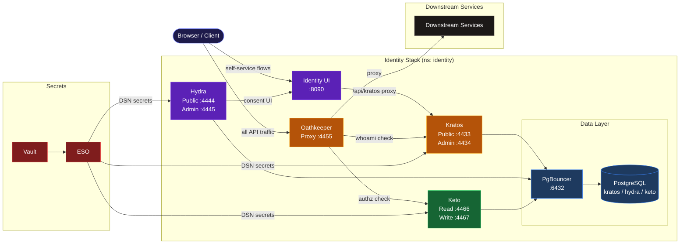

# Identity

Identity and access management for the MathTrail platform, built on the Ory stack.
Handles authentication, sessions, OAuth2/OIDC flows, fine-grained authorization, and API gateway enforcement.

## Architecture



## Quick Start

```bash
just dev      # Skaffold dev loop — deploys everything + port-forward
just deploy   # One-shot deploy (no watch)
just delete   # Tear down
just status   # Pod health overview
```

## Services

| Service | Doc | Port(s) |
|---------|-----|---------|
| Ory Kratos — Identity & Sessions | [docs/kratos.md](docs/kratos.md) | 4433 (public), 4434 (admin) |
| Ory Hydra — OAuth2 / OIDC | [docs/hydra.md](docs/hydra.md) | 4444 (public), 4445 (admin) |
| Ory Keto — Permissions (ReBAC) | [docs/keto.md](docs/keto.md) | 4466 (read), 4467 (write) |
| Ory Oathkeeper — API Gateway | [docs/oathkeeper.md](docs/oathkeeper.md) | 4455 (proxy), 4456 (api) |
| Identity UI — Self-service SPA | [docs/identity-ui.md](docs/identity-ui.md) | 8090 (via port-forward) |

## Proxied Paths

All traffic enters through Traefik at `https://mathtrail.localhost` and is routed to Oathkeeper for auth enforcement.

| Path | Upstream | Auth |
|------|----------|------|
| `/health/*` | identity-ui | none |
| `/auth/*` | identity-ui | anonymous |
| `/assets/*` | identity-ui | anonymous |
| `/api/kratos/*` | identity-ui → Kratos | n/a (direct, no Oathkeeper) |
| `/api/hydra-admin/*` | identity-ui → Hydra | n/a (direct, no Oathkeeper) |
| `/api/*` | mentor-api | cookie_session or bearer_token |
| `/swagger/mentor/*` | mentor-api | cookie_session |
| `/mentor/*` | mentor-api | bearer_token + Keto ReBAC |
| `/observability/grafana/*` | lgtm-grafana.monitoring | cookie_session + `Monitoring:ui#viewer` |
| `/observability/pyroscope/*` | pyroscope.monitoring | cookie_session + `Monitoring:ui#viewer` |
| `/observability/kafka-ui*` | streaming-kafka-ui.streaming | cookie_session + `Monitoring:ui#viewer` |
| `/observability/apicurio*` | streaming-apicurio-apicurio-registry.streaming | cookie_session + `Monitoring:ui#viewer` |
| `/observability/eventcatalog*` | streaming-eventcatalog-eventcatalog-local.streaming | cookie_session + `Monitoring:ui#viewer` |
| `/observability/minio*` | streaming-minio-console.streaming | cookie_session + `Monitoring:ui#viewer` |
| `/observability/risingwave*` | risingwave-frontend-meta-headless.streaming | cookie_session + `Monitoring:ui#viewer` |
| `/observability/argocd*` | → argocd.mathtrail.localhost (redirect) | — |
| `/identity/kratos/*` | kratos-admin.identity | cookie_session + `Identity:admin#viewer` |
| `/identity/hydra/*` | hydra-admin.identity | cookie_session + `Identity:admin#viewer` |
| `/identity/keto/*` | keto-read.identity | cookie_session + `Identity:admin#viewer` |
| `/identity/oathkeeper/*` | oathkeeper-api.identity | cookie_session + `Identity:admin#viewer` |

## Granting Admin Access

Both `/observability/*` and `/identity/*` UIs require Keto relations stored in PostgreSQL —
**lost on cluster rebuild**, re-grant after each rebuild.

**Step 1 — Log in**

Open `https://mathtrail.localhost/auth/login` and sign in with Google.

**Step 2 — Find your user ID**

Open `https://mathtrail.localhost/api/kratos/sessions/whoami` in the browser.
Copy the value of `identity.id` from the JSON response.

**Step 3 — Grant access** (requires `just dev` or port-forward to be running)

```bash
just grant-admin <identity.id>
```

Grants both `Monitoring:ui#viewer` (observability UIs) and `Identity:admin#viewer` (identity admin UIs).

After that, the following URLs are accessible:

| UI | URL |
|----|-----|
| Kafka UI | https://mathtrail.localhost/observability/kafka-ui/ |
| Apicurio Registry | https://mathtrail.localhost/observability/apicurio/ |
| EventCatalog | https://mathtrail.localhost/observability/eventcatalog/ |
| MinIO Console | https://minio.mathtrail.localhost/ (redirects from /observability/minio) |
| RisingWave Dashboard | https://risingwave.mathtrail.localhost/ (redirects from /observability/risingwave) |
| Grafana | https://mathtrail.localhost/observability/grafana/ |
| Pyroscope | https://mathtrail.localhost/observability/pyroscope/ |
| ArgoCD | https://argocd.mathtrail.localhost/ (redirects from /observability/argocd) |
| Kratos Admin API (no UI) | https://mathtrail.localhost/identity/kratos/health/alive |
| Hydra Admin API (no UI) | https://mathtrail.localhost/identity/hydra/health/alive |
| Keto Read API (no UI) | https://mathtrail.localhost/identity/keto/health/alive |
| Oathkeeper API (no UI) | https://mathtrail.localhost/identity/oathkeeper/health/alive |


## Data

Each Ory service has its own PostgreSQL database (`kratos`, `hydra`, `keto`), accessed via PgBouncer in **session mode** (required for prepared statement support).

## Secrets

Managed via HashiCorp Vault + External Secrets Operator.
Vault path: `secret/data/{env}/mathtrail-identity/`

## Infrastructure

```
values/               Ory Helm values (kratos, hydra, keto, oathkeeper)
infra/helm/           Custom Helm charts
  identity-ui/        Identity UI chart (mathtrail-service-lib based)
  identity-db-init/   DB + role initialisation job
infra/local/helm/     Local dev infrastructure
  identity-postgres/  PostgreSQL
  identity-pgbouncer/ PgBouncer
configs/              Static config files mounted into pods
  kratos/             identity.schema.json
  keto/               namespaces.ts
  oathkeeper/         access-rules.yaml
manifests/            Raw Kubernetes manifests
  network-policies.yaml
```
