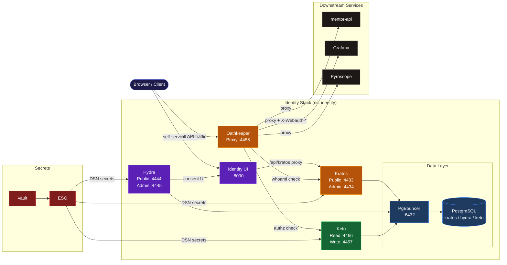

# Identity

Identity and access management for the MathTrail platform, built on the Ory stack.
Handles authentication, sessions, OAuth2/OIDC flows, fine-grained authorization, and API gateway enforcement.

## Architecture



## Quick Start

```bash
just dev      # Skaffold dev loop — deploys everything + port-forward
just deploy   # One-shot deploy (no watch)
just delete   # Tear down
just status   # Pod health overview
```

## Services

| Service | Doc | Port(s) |
|---------|-----|---------|
| Ory Kratos — Identity & Sessions | [docs/kratos.md](docs/kratos.md) | 4433 (public), 4434 (admin) |
| Ory Hydra — OAuth2 / OIDC | [docs/hydra.md](docs/hydra.md) | 4444 (public), 4445 (admin) |
| Ory Keto — Permissions (ReBAC) | [docs/keto.md](docs/keto.md) | 4466 (read), 4467 (write) |
| Ory Oathkeeper — API Gateway | [docs/oathkeeper.md](docs/oathkeeper.md) | 4455 (proxy), 4456 (api) |
| Identity UI — Self-service SPA | [docs/identity-ui.md](docs/identity-ui.md) | 8090 (via port-forward) |

## Data

Each Ory service has its own PostgreSQL database (`kratos`, `hydra`, `keto`), accessed via PgBouncer in **session mode** (required for prepared statement support).

## Secrets

Managed via HashiCorp Vault + External Secrets Operator.
Vault path: `secret/data/{env}/mathtrail-identity/`

## Infrastructure

```
values/               Ory Helm values (kratos, hydra, keto, oathkeeper)
infra/helm/           Custom Helm charts
  identity-ui/        Identity UI chart (mathtrail-service-lib based)
  identity-db-init/   DB + role initialisation job
infra/local/helm/     Local dev infrastructure
  identity-postgres/  PostgreSQL
  identity-pgbouncer/ PgBouncer
configs/              Static config files mounted into pods
  kratos/             identity.schema.json
  keto/               namespaces.ts
  oathkeeper/         access-rules.yaml
manifests/            Raw Kubernetes manifests
  network-policies.yaml
```
